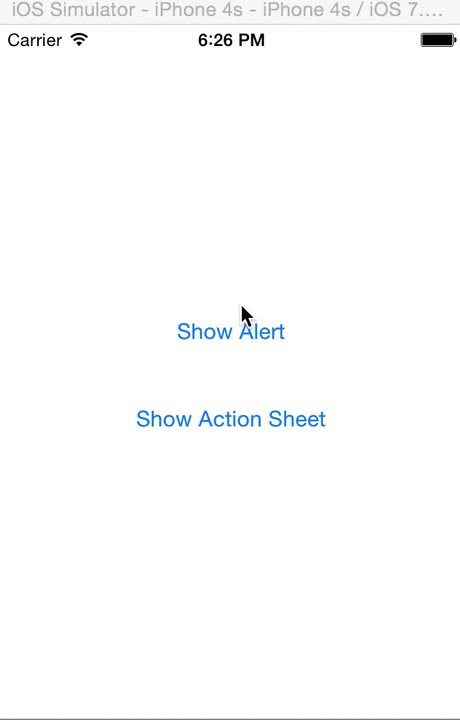
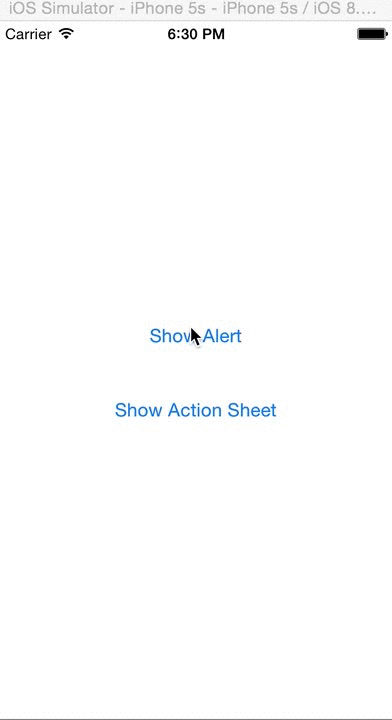

# MOAlertController

[](http://cocoadocs.org/docsets/MOAlertController)
[](http://cocoadocs.org/docsets/MOAlertController)
[](http://cocoadocs.org/docsets/MOAlertController)

## You do not have to consider gap iOS7 and iOS8 when you use UIAlertController!!

#### MOAlertController has same feature at UIAlertController because it is wapper class for UIAlertController, UIAlertView and UIActionSheet.
- Alert
- ActionSheet

#### iOS7


#### iOS8


## Usage

To run the example project, clone the repo, and run `pod install` from the Example directory first.


#### For Alert
Set ```MOAlertControllerStyleAlert``` to preferredStyle.


``` objective-c

	MOAlertController *alertController = [MOAlertController alertControllerWithTitle:@"MOAlertController" message:@"This is MOAlertController." preferredStyle:MOAlertControllerStyleAlert];
    
    MOAlertAction *action = [MOAlertAction actionWithTitle:@"Cancel" style:MOAlertActionStyleCancel handler:^(MOAlertAction *action) {
        //Write a code for this action.
    }];
    [alertController addAction:action];
    
    MOAlertAction *action2 = [MOAlertAction actionWithTitle:@"Destructive" style:MOAlertActionStyleDestructive handler:^(MOAlertAction *action) {
        //Write a code for this action.
    }];
    [alertController addAction:action2];
    
    MOAlertAction *action3 = [MOAlertAction actionWithTitle:@"Default" style:MOAlertActionStyleDefault handler:^(MOAlertAction *action) {
        //Write a code for this action.
    }];
    [alertController addAction:action3];
    
    [controller presentViewControllerWithCurrentViewController:self];;
	
```


#### For Action Sheet
Set ```MOAlertControllerStyleActionSheet``` to preferredStyle.


``` objective-c

	MOAlertController *alertController = [MOAlertController alertControllerWithTitle:@"MOAlertController" message:@"This is MOAlertController." preferredStyle:MOAlertControllerStyleActionSheet];
    
    MOAlertAction *action = [MOAlertAction actionWithTitle:@"Cancel" style:MOAlertActionStyleCancel handler:^(MOAlertAction *action) {
        //Write a code for this action.
    }];
    [alertController addAction:action];
    
    MOAlertAction *action2 = [MOAlertAction actionWithTitle:@"Destructive" style:MOAlertActionStyleDestructive handler:^(MOAlertAction *action) {
        //Write a code for this action.
    }];
    [alertController addAction:action2];
    
    MOAlertAction *action3 = [MOAlertAction actionWithTitle:@"Default" style:MOAlertActionStyleDefault handler:^(MOAlertAction *action) {
        //Write a code for this action.
    }];
    [alertController addAction:action3];
    
    [controller presentViewControllerWithCurrentViewController:self];
	
```

## Requirements
- iOS 7.0 and greater
- ARC

## Installation

MOAlertController is available through [CocoaPods](http://cocoapods.org). To install
it, simply add the following line to your Podfile:

    pod "MOAlertController"

## Author

Taiki Suzuki, s1180183@gmail.com

## License

MOAlertController is available under the MIT license. See the LICENSE file for more info.

